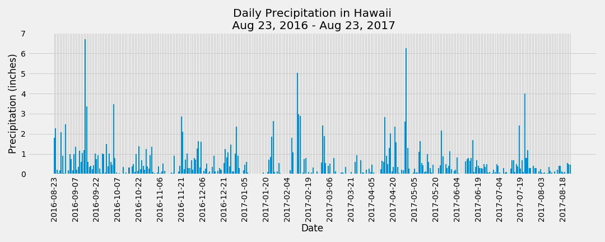
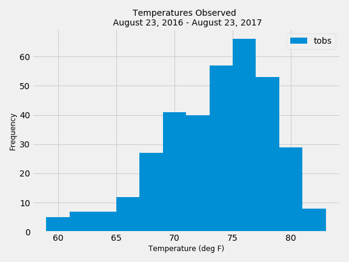
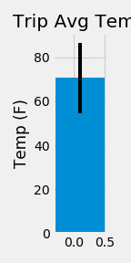

# sqlalchemy-challenge
Temperature and precipitation data for Hawaii weather stations were analyzed to determine what kind of weather to expect for an upcoming vacation. 

Using Pandas, SQLAlchemy, and Matplotlib daily precipitation values for the last year were plotted.  A histogram of average temperatures observed was created, and finally an average tempearture with minimum and maximum temperature range was made.

